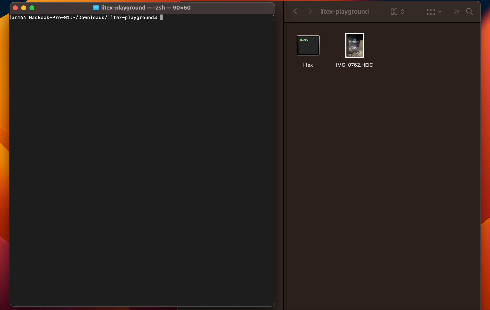

# LiTeX

<p align="center">
    
</p>

**LiTeX** allows use [Live Text](https://support.apple.com/en-us/HT212630) as the command line tool and output results to a text file.

LiTeX requires **macOS 13** (using [ImageAnalyzer of VisionKit](https://developer.apple.com/documentation/visionkit/imageanalyzer))

<p align="center">
    
</p>

## Usage

```sh
USAGE: litex <imagefile-path>

ARGUMENTS:
  <imagefile-path>        An image filepath.

OPTIONS:
  --version               Show the version.
  -h, --help              Show help information.
```

## Installation

1. Download the latest version binary file
2. Open terminal app and move to the directory contating the "litex" file
3. Add the executable permission to the file: `chmod +x litex`
4. Move the file to the /usr/local/bin directory: `mv litex /usr/local/bin`

## Requirements

- macOS 13.0+
- Xcode 14.1+

## Swift Package Dependencies

- [Swift Argument Parser](https://github.com/apple/swift-argument-parser) 1.1.0+
